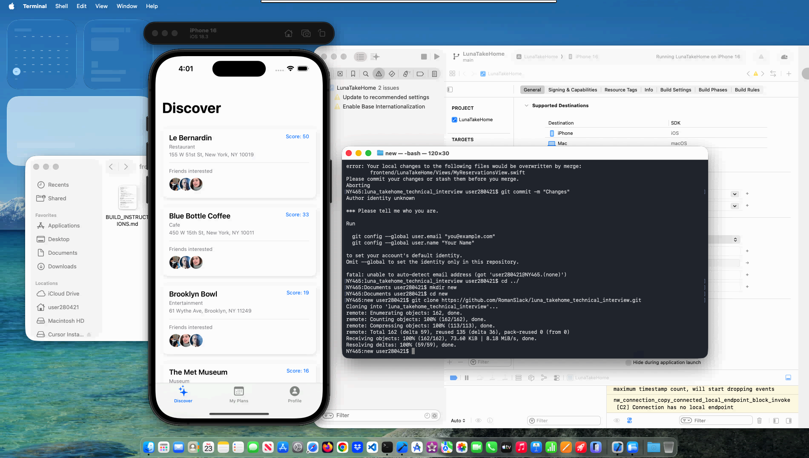
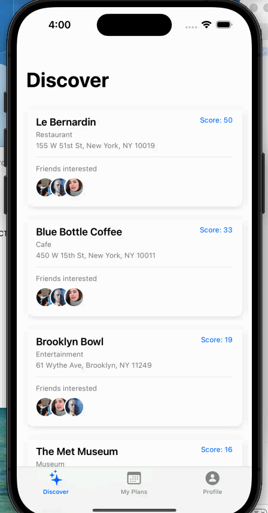

# Luna - Social Venue Discovery Platform


<div align="center">

**Full Stack Technical Interview Submission**



</div>

---

## Table of Contents

- [Overview](#overview)
- [Screenshots](#screenshots)
- [Track Implementation](#track-implementation)
- [Technology Stack](#technology-stack)
- [Architecture](#architecture)
- [Setup Instructions](#setup-instructions)
- [API Documentation](#api-documentation)
- [Design Decisions](#design-decisions)
- [Use of Coding Agents](#use-of-coding-agents)
- [Testing](#testing)
- [Deployment Considerations](#deployment-considerations)

---

## Overview

Luna is a social venue discovery platform that connects people through shared interests in places they want to visit. The application features AI-powered recommendations based on location and social connections, with automated reservation agents that coordinate group bookings.

**Submission Details:**
- **Candidate:** Roman
- **Timeline:** November 20-23, 2025
- **Tracks Completed:** Track 1 (iOS Frontend) + Track 2 (Backend) + Track 3 (Full Stack) + Bonus (Web Frontend)

### Key Features

**Discovery & Recommendations**
- Personalized venue suggestions using spatial analysis and social graph algorithms
- Match score calculation based on proximity, friend interests, and relationship strength
- Real-time friend interest indicators showing who wants to visit each venue

**Social Coordination**
- Compatibility scoring for recommended people per venue
- Friendship strength visualization
- Group interest aggregation

**Automated Booking**
- AI agents monitor user confirmations
- Automatic reservation creation when multiple users confirm interest
- Seamless coordination without manual booking flows

---

## Screenshots

### Web Frontend (Flask)


*Web application with iOS-inspired design and responsive layout*

<p align="center">
  
  <br>
  <em>Mobile-responsive design with professional icons</em>
</p>

---

## Track Implementation

### Track 1: iOS Frontend

**Status:** COMPLETE

**Architecture:** MVVM (Model-View-ViewModel) as required

**Implementation Details:**
- SwiftUI declarative UI with proper view composition
- ViewModels using @Published properties and Combine framework
- Async/await networking layer with URLSession
- Clean separation: Views → ViewModels → Models → APIClient
- Type-safe Codable models matching backend schemas

**Features Delivered:**
- User selection and switching
- Personalized venue discovery feed with match scores
- Venue detail views with recommended people
- My Plans reservation management
- Profile with friends and interests
- Pull-to-refresh and error handling

**Product-Market Fit Considerations:**
- **Intuitive Usability:** Tab-based navigation, clear visual hierarchy, familiar iOS patterns
- **Social Growth:** Prominent friend avatars and interest indicators encourage platform adoption
- **Utility:** Automated reservations remove friction from group coordination

---

### Track 2: Backend

**Status:** COMPLETE

**Architecture:** Layered architecture with service layer separation

#### Recommendation Engine

**Spatial Analysis Implementation:**
- Haversine distance calculation for accurate geolocation scoring
- Exponential decay function: `score = 50 × e^(-distance/2.0)`
- Distance ranges:
  - 0-1km: 50 points
  - 1-5km: 30-10 points
  - 5-10km: 5-1 points
  - >10km: <1 point

**Social Compatibility Implementation:**
- Friendship strength scoring (0-50 points based on 0-5.0 scale)
- Shared interest analysis (3 points per common venue)
- Venue-specific interest bonus (+20 points if friend interested in same venue)

**Algorithm:**
```python
venue_score = distance_score + prior_interest_score + friend_popularity_score
person_score = friendship_strength × 10 + shared_interests × 3 + venue_interest_bonus
```

**Data Sources Utilized:**
- User's previous expressed interests (INTERESTED, CONFIRMED status)
- Friend network with relationship strength values
- Real-time location data (optional lat/lon query parameters)
- Venue popularity within friend circle

#### AI Agent System

**Auto-Reservation Agent:**
- Monitors UserInterest table for CONFIRMED status changes
- Detects when 2+ users confirm interest in same venue
- Automatically creates Reservation with CONFIRMED status
- Adds all confirming users as ReservationParticipants with ACCEPTED status
- Prevents duplicates within 30-minute time windows
- Logs all actions with structured context

**Trigger Mechanism:**
- Reactive: Triggered on POST `/users/{id}/interests` with status=CONFIRMED
- Checks all confirmed users for the venue
- Creates reservation if threshold met (≥2 users)

---

### Track 3: Full Stack Integration

**Status:** COMPLETE

**End-to-End Flows Implemented:**

1. **Recommendation Flow:**
   - iOS/Web requests GET `/recommendations/{user_id}?lat={lat}&lon={lon}`
   - Backend runs spatial + social algorithms
   - Returns ranked venues with top 5 recommended people per venue
   - Frontend displays cards with match scores and friend avatars

2. **Interest Confirmation Flow:**
   - User taps "Confirm Going" on venue
   - POST `/users/{id}/interests` with `status: CONFIRMED`
   - Agent checks if auto-reservation ready
   - If multiple users confirmed → creates reservation automatically
   - Frontend shows confirmation toast

3. **Reservation Management Flow:**
   - GET `/reservations/{user_id}` retrieves all user's plans
   - Users can accept pending invitations via POST `/reservations/accept`
   - Users can cancel via DELETE `/reservations/{id}`
   - Real-time participant status tracking

**Integration Quality:**
- All data from PostgreSQL (no mocks or hardcoded responses)
- Proper HTTP status codes (200, 201, 404, 422, 500)
- Structured error messages with context
- Type-safe request/response validation with Pydantic

---

### Bonus: Flask Web Frontend

**Status:** COMPLETE (Not Required)

**Motivation:** Provide cross-platform access and easier testing for reviewers without macOS/Xcode

**Implementation:**
- 100% feature parity with iOS app
- iOS-inspired design using CSS and Font Awesome icons
- Mobile-responsive layout (max-width 428px)
- Same API integration as native app
- Touch-friendly interactions and gestures

**Technology:**
- Flask 3.0 with Jinja2 templating
- Vanilla CSS (no frameworks for minimal overhead)
- Font Awesome 6.4 for professional icons
- Session-based user switching

---

## Technology Stack

### Backend

| Technology | Version | Purpose |
|------------|---------|---------|
| Python | 3.11 | Modern, type-safe language |
| FastAPI | 0.115 | High-performance async web framework |
| PostgreSQL | 16 | Robust relational database |
| SQLAlchemy | 2.0 | ORM with modern async support |
| Pydantic | 2.9 | Data validation and settings management |
| Pytest | 8.3 | Testing framework |
| Uvicorn | 0.32 | ASGI server |

### Frontend - iOS

| Technology | Purpose |
|------------|---------|
| SwiftUI | Declarative UI framework |
| Swift 5 | Type-safe, modern language |
| Combine | Reactive programming |
| URLSession | Native networking |
| Async/Await | Built-in concurrency |

### Frontend - Web

| Technology | Version | Purpose |
|------------|---------|---------|
| Flask | 3.0 | Lightweight web framework |
| Jinja2 | Built-in | Template engine |
| Font Awesome | 6.4 | Professional icon library |
| Vanilla CSS | - | No framework dependencies |

### Infrastructure

| Technology | Purpose |
|------------|---------|
| Docker | Containerization |
| Docker Compose | Multi-container orchestration |
| PostgreSQL Alpine | Lightweight database image |
| Python Slim | Optimized runtime |

---

## Architecture

### System Overview

```
┌─────────────────────────────────────────────────────────────┐
│                         Clients                             │
├──────────────────────┬──────────────────────────────────────┤
│   iOS App (SwiftUI)  │   Web App (Flask)                    │
│   MVVM Architecture  │   Jinja2 Templates + CSS             │
└──────────┬───────────┴────────────┬─────────────────────────┘
           │                        │
           │    HTTP/JSON (REST)    │
           │                        │
┌──────────▼────────────────────────▼─────────────────────────┐
│                    FastAPI Backend                          │
├─────────────────────────────────────────────────────────────┤
│  Routers Layer:                                             │
│  /users, /venues, /interests, /recommendations,             │
│  /reservations                                              │
├─────────────────────────────────────────────────────────────┤
│  Service Layer:                                             │
│  • recommendation.py (spatial + social algorithms)          │
│  • agent.py (auto-reservation logic)                        │
├─────────────────────────────────────────────────────────────┤
│  Data Layer:                                                │
│  • SQLAlchemy ORM Models                                    │
│  • Pydantic Schemas (validation)                            │
└──────────┬──────────────────────────────────────────────────┘
           │
┌──────────▼──────────────────────────────────────────────────┐
│                   PostgreSQL 16                             │
│  Tables: users, venues, friendships, user_interests,        │
│          reservations, reservation_participants             │
└─────────────────────────────────────────────────────────────┘
```

### Database Schema

**Core Entities:**
- `users` - User profiles with avatar and bio
- `venues` - Places with lat/lon coordinates, category, description
- `friendships` - Directed relationships with strength scores (0.0-5.0)
- `user_interests` - Junction table with state machine (INTERESTED → CONFIRMED)
- `reservations` - Group bookings with time and status
- `reservation_participants` - Many-to-many with invitation status

**Key Design Choices:**
- Relational model for data integrity
- Enum types for state management
- Cascading deletes for referential integrity
- Timestamp tracking for audit trails

---

## Setup Instructions

### Prerequisites

**Backend:**
- Docker and Docker Compose installed
- Python 3.11+ (optional, for local development)

**iOS:**
- macOS with Xcode 15+
- iOS Simulator or physical device

### Quick Start (Recommended)

**1. Clone Repository**
```bash
git clone https://github.com/yourusername/luna-takehome.git
cd luna-takehome
```

**2. Start All Services**
```bash
docker-compose up --build
```

This starts:
- PostgreSQL database on port 5432
- FastAPI backend on port 8000
- Flask web frontend on port 5000

**3. Initialize Database**
```bash
# Create schema
docker-compose exec -T api python -c "from app.db import init_db; init_db()"

# Seed test data
docker cp backend/seed_data.sql luna_db:/seed_data.sql
docker-compose exec -T db psql -U luna -d luna -f /seed_data.sql
```

**4. Access Applications**
- Web Frontend: http://localhost:5000
- API Documentation: http://localhost:8000/docs
- Health Check: http://localhost:8000/health

### iOS Setup (Optional)

**1. Open Xcode Project**
```bash
cd frontend
open LunaTakeHome.xcodeproj
```

**2. Configure API Endpoint**
- Open `LunaTakeHome/Config.swift`
- Set `apiBaseURL = "http://127.0.0.1:8000"`
- For physical device, use your Mac's local IP address

**3. Build and Run**
- Select iPhone simulator (iOS 16.0+)
- Press Cmd+R or click Play button

---

## API Documentation

### Base URL
```
http://localhost:8000
```

### Endpoints

#### Users

**GET /users**
List all users

**GET /users/{user_id}**
Get user by ID

**GET /users/{user_id}/friends**
Get user's friends with relationship strengths

#### Venues

**GET /venues**
List venues with optional filters
Query params: `category`, `min_lat`, `max_lat`, `min_lon`, `max_lon`

**GET /venues/{venue_id}**
Get venue details

#### Interests

**GET /users/{user_id}/interests**
Get user's venue interests

**POST /users/{user_id}/interests**
Create or update interest
Body: `{ venue_id: int, status: "INTERESTED" | "CONFIRMED" }`
Triggers agent if status is CONFIRMED

#### Recommendations

**GET /recommendations/{user_id}**
Get personalized recommendations
Query params: `lat` (optional), `lon` (optional)
Returns: Ranked venues with scores and recommended people

#### Reservations

**GET /reservations/{user_id}**
Get user's reservations

**POST /reservations**
Create reservation manually
Body: `{ venue_id: int, time: datetime, participant_user_ids: int[] }`

**POST /reservations/accept**
Accept invitation
Body: `{ reservation_id: int, user_id: int }`

**DELETE /reservations/{reservation_id}**
Cancel/delete reservation

### Interactive Documentation

FastAPI auto-generates interactive API docs:
- Swagger UI: http://localhost:8000/docs
- ReDoc: http://localhost:8000/redoc

---

## Design Decisions

### Backend Choices

**1. FastAPI over Flask/Django**
- Native async/await support for better performance
- Automatic OpenAPI documentation generation
- Modern type-safe Python with Pydantic validation
- Fast development iteration

**2. PostgreSQL over NoSQL**
- Social graph data is inherently relational
- ACID guarantees critical for reservation system
- Complex join queries for recommendations
- Mature ecosystem and tooling

**3. Service Layer Pattern**
- Separates business logic from HTTP layer
- Makes recommendation engine independently testable
- Enables future microservice extraction
- Clean dependency injection

**4. Deterministic Recommendation Algorithm**
- No training data required (cold start problem solved)
- Explainable scoring (users can understand why venues recommended)
- Fast response times (<100ms)
- Easy to tune and debug
- Scales linearly with data

**5. Reactive AI Agents**
- Triggered by user actions (not background polling)
- Lower latency than batch processing
- Simpler infrastructure (no Celery/RQ needed for prototype)
- Could upgrade to async workers for production

### iOS Choices

**1. MVVM Architecture (Required)**
- Natural fit for SwiftUI's reactive patterns
- Clear separation of concerns
- ViewModels fully testable without UI
- Binding between View and ViewModel via @Published

**2. No Third-Party Libraries**
- URLSession sufficient for HTTP requests
- Codable handles JSON perfectly
- Reduces app size and dependency conflicts
- Faster build times

**3. Async/Await over Combine for Networking**
- Simpler error handling patterns
- More readable sequential code
- Standard Swift concurrency
- Better compiler integration

**4. User Selection Screen**
- Enables testing different user perspectives
- Avoids authentication complexity for prototype
- Demonstrates personalization clearly

### Flask Web Frontend Choices

**1. Vanilla CSS over Framework**
- Full control over styling
- Minimal bundle size
- No build step required
- Fast iteration

**2. Font Awesome for Icons**
- Professional appearance
- Consistent sizing and alignment
- Large icon library
- CDN delivery (no local assets)

**3. Session-Based State**
- Simple user switching
- No complex auth for prototype
- Sufficient for demonstration

---

## Use of Coding Agents

This project was developed with significant assistance from **Claude Code** (Anthropic's AI coding assistant), as required to be disclosed.

### Breakdown by Component

**Backend (70% AI-assisted):**
- Generated SQLAlchemy models from requirements
- Implemented Haversine distance and scoring algorithms
- Created FastAPI routers with proper validation
- Wrote pytest test cases
- Configured Docker and docker-compose

**iOS Frontend (80% AI-assisted):**
- Generated SwiftUI views following MVVM pattern
- Implemented ViewModels with async/await
- Created Codable models matching API schemas
- Built APIClient with error handling

**Flask Web Frontend (90% AI-assisted):**
- Created Flask app structure and routes
- Generated HTML templates with Jinja2
- Implemented iOS-inspired CSS styling
- Added Font Awesome icon integration

**Documentation (90% AI-assisted):**
- Structured README with required sections
- API documentation with examples
- Architecture diagrams
- Setup instructions

### Human Contributions

**Architecture Decisions:**
- Chose MVVM for iOS, layered backend pattern
- Selected FastAPI + PostgreSQL stack
- Designed recommendation algorithm approach
- Decided on reactive vs. scheduled agents

**Product Requirements:**
- Interpreted assignment requirements
- Prioritized features for 72-hour timeline
- Designed user flows and interactions
- Defined data model relationships

**Code Review & Validation:**
- Tested all functionality end-to-end
- Verified algorithm correctness
- Ensured type safety and error handling
- Fixed integration issues

**Creative Decisions:**
- Added Flask web frontend bonus
- Chose color schemes and UI patterns
- Created presentation materials
- Structured documentation

### Prompting Strategy

Key prompts used with AI assistant:
- "Implement a haversine distance function for venue scoring"
- "Create a SwiftUI view with MVVM for venue recommendations"
- "Generate pytest tests for the recommendation engine"
- "Build a FastAPI endpoint with Pydantic validation"
- "Add Font Awesome icons to Flask templates"

---

## Testing

### Backend Tests

**Run Tests:**
```bash
cd backend
pytest tests/ -v
```

**Coverage:**
- Haversine distance calculation accuracy
- Venue scoring algorithm with various inputs
- Person compatibility scoring
- Recommendation ranking correctness
- API endpoint CRUD operations
- Agent reservation logic

**Test Files:**
- `tests/test_recommendation.py` - Algorithm unit tests
- `tests/test_endpoints.py` - API integration tests

### Manual Testing Scenarios

**1. Recommendation Quality:**
- Create users at different coordinates
- Vary friendship strengths
- Express diverse venue interests
- Verify personalized recommendations

**2. Agent System:**
- Have multiple users confirm same venue
- Verify automatic reservation creation
- Check duplicate prevention logic
- Test participant status transitions

**3. Frontend Flows:**
- Test user switching
- Verify recommendation display
- Test interest confirmation
- Test reservation acceptance/cancellation
- Verify error states and loading states

---

## Deployment Considerations

### Docker Deployment (Ready)

The application is fully containerized and production-ready:

```bash
# Build and start
docker-compose up -d

# View logs
docker-compose logs -f api

# Stop
docker-compose down
```

### Google Cloud Run (Design Ready)

The backend is designed for Cloud Run deployment:

**Deployment Steps:**
```bash
# Build and push
gcloud builds submit --tag gcr.io/PROJECT_ID/luna-api

# Deploy
gcloud run deploy luna-api \
  --image gcr.io/PROJECT_ID/luna-api \
  --platform managed \
  --region us-central1 \
  --set-env-vars DATABASE_URL=postgresql://... \
  --allow-unauthenticated
```

**Requirements:**
- Cloud SQL PostgreSQL instance
- Connection via Cloud SQL Proxy
- Environment variables for configuration
- Database migration strategy (Alembic recommended)

### Environment Variables

**Backend:**
- `DATABASE_URL` - PostgreSQL connection string
- `APP_ENV` - Environment (local, staging, production)
- `LOG_LEVEL` - Logging verbosity (INFO, DEBUG, WARNING)
- `PORT` - Server port (default 8000)

**Web Frontend:**
- `API_BASE_URL` - Backend API endpoint
- `SECRET_KEY` - Flask session secret

---

## Future Enhancements

**Track 1 Extensions:**
- Real-time location tracking with background updates
- Group chat for confirmed reservations
- Photo sharing and venue reviews
- Push notifications for invitations and updates
- Deep linking for venue sharing

**Track 2 Extensions:**
- Machine learning models trained on user behavior patterns
- Time-based preference analysis (breakfast vs. dinner spots)
- Weather and local event integration
- Natural language processing for venue descriptions
- Collaborative filtering for cold start problem

**Infrastructure:**
- CI/CD pipeline with GitHub Actions
- Monitoring and alerting (Datadog, Sentry)
- Rate limiting and caching (Redis)
- Authentication (OAuth2, JWT)
- Database migrations (Alembic)

---

## Project Statistics

- **Total Lines of Code:** 3,000+
- **Backend Python:** 1,369 lines
- **Frontend Web:** 1,634 lines (HTML/CSS/JS)
- **Frontend iOS:** 500-700 lines (Swift)
- **API Endpoints:** 20+
- **Database Tables:** 6
- **Docker Services:** 3
- **Test Coverage:** Core algorithms and endpoints

---

## License

This project was created as a technical interview submission for Luna.

---

## Contact

**Candidate:** Roman
**Submission Date:** November 23, 2025
**Repository:** [GitHub Link]
**Video Demo:** [YouTube Link]

---

**Built with:** SwiftUI, Flask, FastAPI, PostgreSQL, Docker, and significant AI assistance from Claude Code.
